# Alpha2MQTT (A2M)
## A smart home interface for AlphaESS solar and battery inverters.

_**NEW!** For a complete accompanying guide to integrating your Alpha2MQTT with Home Assistant on a Raspberry Pi or Virtual Machine, check [here](https://github.com/dxoverdy/Integrating-Alpha2MQTT-with-Home-Assistant)._

### Supported devices are:
```
SMILE5,
SMILE-B3,
SMILE-T10,
Storion T30,
SMILE-B3-PLUS (Confirmed by a user of Alpha2MQTT.)
*Others are likely to work too.
```


Watch the video of the boot up sequence here:

[](https://youtu.be/3hRjaeRWqJ4)

Alpha2MQTT (A2M) is a remote control interface for AlphaESS inverters which support Modbus via RS485.

It allows full remote control of the inverter (i.e. forcibly charge the battery from the grid on demand / forcibly discharge the battery to the grid on demand / return to normal mode on demand / setting date / time / PV capacity as displayed on the Alpha Cloud / and a **lot** more and can report various information based on repeating schedules of every 10 seconds, every 1 minute, every 5 minutes, every hour and every day.

Communication with Alpha2MQTT is via MQTT and can be driven by home integration solutions such as [Home Assistant](https://www.home-assistant.io/), [Node-Red](https://nodered.org/) and anything else which is MQTT compatible.

It's designed to run on an ESP8266 or ESP32 microcontroller (it was developed on a Wemos D1 mini) with a TTL to RS485 module such as the MAX3485.

Alpha2MQTT honours 1.23 AlphaESS Modbus documentation:

[AlphaESS Modbus Documentation](https://www.alpha-ess.de/images/downloads/handbuecher/AlphaESS-Handbuch_SMILE_ModBus_RTU_TCP_V2.pdf)

[AlphaESS Register List](https://www.alpha-ess.de/images/downloads/handbuecher/AlphaESS_Register_Parameter_List.pdf)

[Alternate AlphaESS Modbus Documentation Link](Pics/AlphaESS-Handbuch_SMILET30_ModBus_RTU_V123-DE.pdf)

It is only available in German however Google offers PDF translation which I have used to good effect for English.


## States
To receive information from any of the repeating schedules, subscribe your MQTT client to:
```
Alpha2MQTT/state/second/ten
Alpha2MQTT/state/minute/one
Alpha2MQTT/state/minute/five
Alpha2MQTT/state/hour/one
Alpha2MQTT/state/day/one
```

Each of the schedules can be customised to report a number* / any combination of register values.  Alpha2MQTT has been developed this way to give flexibility.  For example, there is probably no need to report grid voltage every ten seconds, instead once every five minutes and in doing so we are limiting network traffic over MQTT and onward processing in software such as Home Assistant.


### By default

#### Every ten seconds:
```
Battery State Of Charge (%)
Battery Power (+/-) (W)
Battery Voltage (V)
Battery Current (A)
Battery Temp (DegC)
Grid Power (+/-) (W)
Grid Current (+/-) (A)
PV Power (+/-) (W)
Inverter Current (Phase A) (A)
Inverter Power (W)
Inverter Temp (DegC)
Load (W)

Dispatch Start (description as per documentation)
Dispatch Mode (description as per documentation)
Dispatch Power (W) (32000 Offset, < 32000 charge, > 32000 discharge)
Dispatch SOC (%)
Dispatch Time (S)

PV1 Power (+/-) (W) - Hybrid Inverters Only
PV2 Power (+/-) (W) - Hybrid Inverters Only
PV3 Power (+/-) (W) - Hybrid Inverters Only
PV4 Power (+/-) (W) - Hybrid Inverters Only
PV5 Power (+/-) (W) - Hybrid Inverters Only
PV6 Power (+/-) (W) - Hybrid Inverters Only

Total Solar Power (+/-) (W) - Sum of PV Power (CT gathered) and Hybrid PV Power gathered
```

#### Every minute:
```
Grid Voltage (Phase A) (V)
PV Voltage (Phase A) (V)
Inverter Voltage (Phase A) (V)
```

#### Every five minutes:
```
Battery Total Charge (kWh)
Battery Total Discharge (kWh)
Battery Total Charged From Grid (kWh)
```

#### Every one hour:
```
Grid Frequency (Hz)
PV Frequency (Hz)
Inverter Frequency (Hz)
System Fault (description as per documentation)
Battery Fault (description as per documentation)
```

#### Every one day:
```
Total System PV Energy Generated (kWh)
Total Energy Fed To Grid (kWh)
Total Energy Consumed From Grid (kWh)
Total PV Energy Generated (kWh)
Total PV Energy Consumed (kWh)
```

You can customise the schedules by modifying Alpha2MQTT.ino.  Search for 'Schedules' and add or remove registers as you see fit from each schedule.  The list of supported registers begins on line 85 in Definitions.h.  A register name which contains _R_ is read only, one which contains _RW_ is read/write, and one which contains _W_ is write only.

An example response for any subscribed state is a JSON of name/value pairs which are separated by commas, for example:
```
{
    "REG_BATTERY_HOME_R_BATTERY_POWER": 2845,
    "REG_INVERTER_HOME_R_VOLTAGE_L1": 238.4
}
```

## Advanced Read Registers
Appreciating that some people may want to take inverter values in raw form with extra information, Alpha2MQTT supports request and responses for individual registers.  It does this by offering two ways, handled and raw.  A handled register and raw register is essentially the same request to the inverter, however when requesting via the handled route, checks, calculations and balances are done in Alpha2MQTT and the response includes both raw and formatted (as per Modbus documentation) data and information.  For example, where the Modbus documentation indicated a number should undergo manipulation to return something of value, i.e. frequency which needs to be multiplied by 0.01 to return Hz, then a handled read request will return the raw data, as well as the formatted data which underwent calculations.  A handled request for the EMS serial number (ALxxxxxxxxxxxxxxx) will return just that, rather than a series of numbers which need manipulation by you.

### Handled Read
Publish MQTT messages to:
```
Alpha2MQTT/request/read/register/handled
```

With the following JSON
```
{
    "registerAddress": "0x0010"
}
```
where
registerAddress is the hex address of the register as per the documentation, and where the register is a handled register in Definitions.h

Alpha2MQTT will do the rest and will return the response via the following topic which you can subscribe to:
```
Alpha2MQTT/response/read/register/handled
```

An example response for the above request could be:
```
{
    "responseStatus": "readDataRegisterSuccess",
    "registerAddress": "0x0010",
    "functionCode": 3,
    "registerName": "REG_GRID_METER_R_TOTAL_ENERGY_FEED_TO_GRID_1",
    "dataType": "unsignedInt",
    "dataValue": 123515,
    "formattedDataValue": 12351.50,
    "rawDataSize": 4,
    "rawData": [0,1,226,123],
    "end": "true"
}
```

* If the register returns a character dataType then dataValue and formattedDataValue will be in double quotes.

* If the register is a lookup, i.e. 0x1000 (REG_SAFETY_TEST_RW_GRID_REGULATION) Grid_Regulation, formattedDataValue will bring back the appropriate textual lookup, i.e dataValue of 8, formattedDataValue of "CEB".

* 0x0743 (REG_SYSTEM_INFO_R_EMS_SN_BYTE_1_2) EMS SN byte1-2 is the only register which undergoes custom processing in Alpha2MQTT different to spec.  It returns the full 15 character ALxxxxxxxxxxxxxxx serial number in characterValue in one go, and the remaining EMS SN byte-x-y registers are not implemented as they are essentially pointless.

* There is a custom handled register address of 0xFFFF (REG_CUSTOM_SYSTEM_DATE_TIME) which returns the full system date/time in UK dd/MMM/yyyy HH:mm:ss format in formattedDataValue.

* There is a custom handled register address of 0xFFFE (REG_CUSTOM_LOAD) which returns current consumption, also known as load.  It returns in watts.


### Raw Read
Alpha2MQTT supports over 200 registers via the handled route, however it does not cater for registers in the Safety TEST, ATE TEST, CT calibration and Battery - INDUSTRY series categories (with the exception of 0x1000 Grid_Regulation.)  This is because there are many more hundreds of registers in these categories, they are rather niche and on my inverter (SMILE B3) most I cannot query and test.  As such, by providing a raw read functionality Alpha2MQTT can expose any of these registers to advanced users and it will return the raw data bytes for onward processing as you see fit.

Publish MQTT messages to:
```
Alpha2MQTT/request/read/register/raw
```
With the following JSON
```
{
    "registerAddress": "0x0743",
    "dataBytes": 2
}
```
where

registerAddress is the hex address of the register as per the documentation.

dataBytes is the number of bytes to request, as per the Data format column in the Alpha documentation.  Usually follow the documentation, however for registers such as serial numbers / date times you can actually pass more and the Alpha system will duly return more.  For example, the documentation for EMS SN byte1-2 (0x0743) is two bytes
however you can request 16.
```
{
    "registerAddress": "0x0743",
    "dataBytes": 16
}
```

Alpha2MQTT will do the rest and will return the response via the following topic which you can subscribe to:
```
Alpha2MQTT/response/read/register/raw
```

An example response for the above request could be:
```
{
    "responseStatus": "readDataRegisterSuccess",
    "registerAddress": "0x0743",
    "functionCode": 3,
    "rawDataSize": 16,
    "rawData": [65,76,55,48,48,49,48,50,49,48,54,48,51,50,49,0],
    "end": "true"
}
```

## Writing
The AlphaESS documentation mentions two methods to write to registers, "Write Single Register" and "Write Data Register."  Alpha2MQTT supports both.  That said, when I started developing Alpha2MQTT I presumed Write Single Register was an easier way to write a two-byte register, requiring only a value, however my inverter never responds to any Write Single Register request.  The documentation on how to make a request and obtain the response is below, however it is only provided as *Guidance*.  Write Data Register works with any two or four byte register and so for me, for my Smile B3 at least, is the go-to function.

### Write Raw Single Register
Publish MQTT messages to:
```
Alpha2MQTT/request/write/register/raw/single
```
With the following JSON
```
{
    "registerAddress": "0x084F",
    "value": 1
}
```
where

registerAddress is the hex address of the register as per the documentation.

value is the base 10 integer you wish to write to the register.  For example, the above will write 1 to the Time period control flag register and Enable charge time period control and disable discharge time period control.

Alpha2MQTT will do the rest and will return the response via the following topic which you can subscribe to:
```
Alpha2MQTT/response/write/register/raw/single
```

An example response for the above request could be:
```
{
    "responseStatus": "writeSingleRegisterSuccess",
    "registerAddress": "0x084F",
    "functionCode": 6,
    "rawDataSize": 4,
    "rawData": [8,79,0,1]
}
```

In reality, you will probably only ever get the following back:
```
{
    "responseStatus": "noResponse",
    "registerAddress": "0x084F"
}
```
In raw data, the Alpha documentation says byte one is the high byte of the register address, byte two is the low byte of the register address, byte three is the high byte of the value and byte four is the low byte of the value.
Again, for me, this function does nothing and I only provide the above as guidance as to how it should work.  Instead, I recommend just using Write Raw Data Register as documented below.


### Write Raw Data Register
Publish MQTT messages to:
```
Alpha2MQTT/request/write/register/raw/data
```
With the following JSON
```
{
    "registerAddress": "0x0881",
    "dataBytes": 4,
    "value": 30000
}
```
where

registerAddress is the hex address of the register as per the documentation.

dataBytes is the number of bytes to write as appropriate for the register in question as per the Data Format column.

value is the base 10 integer you wish to write to the register.  For example, the above will write 30000 to the Dispatch active power register to essentially set battery charging to 2000W.

* If the register has documentation which suggests values are in hex, keep in mind they need to be written in a single base 10 value (standard numbers you count with) regardless of whether you are writing to a single two-byte register or a double four-byte register.  And all hex values are read out in base 10 bytes, each between 0 and 255.  What does this mean exactly?  Take register 0x080F, the Modbus address.  The documentation refers to the value being 0x55 in hex.  This is true, however this will be read out in rawData as 0, 85.  If you wanted to change the Modbus address to 0x56, you would use a value of 86.  This would be read out in rawData as 0, 86.

* There is a hex starter for ten contained in the README.txt file.


Alpha2MQTT will do the rest and will return the response via the following topic which you can subscribe to:
```
Alpha2MQTT/response/write/register/raw/data
```

An example response for the above request could be:
```
{
    "responseStatus": "writeDataRegisterSuccess",
    "registerAddress": "0x0881",
    "functionCode": 16,
    "rawDataSize": 4,
    "rawData": [8,129,0,2],
    "end": "true"
}
```
In raw data, the Alpha documentation says byte one is the high byte of the register address, byte two is the low byte of the register address, byte three is the high byte of the number of registers and byte four is the low byte of the number of registers.  As this was a four byte register, in reality this is a double register, hence 2 in the last byte.

You can technically be smart and write two registers at once if they are next to each other, but things are complex enough as they are so I advise you don't.

If you take registerAddress of 0x0851 (Discharge Start Time 1,) it is next to registerAddress 0x0852 (Discharge Stop Time 1) and they are two bytes each.  So technically you can get away with writing a single value in to four dataBytes.

If done individually:
```
{
    "registerAddress": "0x0851",
    "value":1,
    "dataBytes":2
}
```
```
{
    "registerAddress": "0x0852",
    "value":4,
    "dataBytes":2
}
```
These two instructions will set start time 1 to 01:00 and stop time 1 to 04:00 respectively.

But combined:
```
{
    "registerAddress": "0x0851",
    "value":65540,
    "dataBytes":4
}
```

Why 65540?
```

                1AM             4AM
00000000 00000001 00000000 00000100 = 65540 in base 10 decimal
```

# WARNING
Double and triple check the dataBytes you send corresponds to the register in the Alpha Documentation.  Writing more or less may have unexpected outcomes!

Double and triple check the value you send.  Writing an invalid or incompatible value may have unexpected outcomes!

I have written to most of the R/W registers where I have had an interest in doing so, and it appears AlphaESS have developed this to be pretty robust where it just disregards junk requests, however please, employ discretion at all times!


## Slave Errors
If the request and response was successful, but the inverter failed to carry out the task for some reason, it will return a slave error.  The response to any request above will be of the following format if so:
```
{
    "responseStatus": "slaveError",
    "functionCode": 16,
    "slaveErrorCode": 321
    "end": "true"
}
```
where

slaveErrorCode is an unknown number.  Note that slave errors are not covered in the AlphaESS documentation, and not having received a slave error response I cannot give guidance as to what would cause errors, or what potential slaveErrorCodes could be.


## Force Charge From Grid
As we now have nifty functionality to command the inverter as we see fit, Alpha2MQTT has some MQTT topics to send messages to to instruct it to charge from the grid.  All this is doing is essentially batching up some appropriate Write Data Register commands and exposing them as a single MQTT topic for ease of use.

Publish MQTT messages to:
```
Alpha2MQTT/request/set/charge
```

With the following JSON
```
{
    "watts": 2500,
    "socPercent": 100,
    "duration": 14400
}
```
where

watts is the power at which you want to charge the batteries with.  You can specify a number greater than the inverter/battery supports, the system will limit accordingly.  They provide this functionality in case you don't want to hammer your batteries at full power.  Note that it will charge at this rate utilising PV power too.  As such, if you set watts to 2500 and PV is generating 1000, it will pull 1500 from the grid.  As I suspect this will be largely used during the night when electricity rates are cheaper (such as Octopus Go / Economy 7) then this is largely irrelevant.

socPercent is where you want charging to stop.  If you want to stop charging at 80% as you believe the weather tomorrow will do the rest, set this to 80.  Otherwise, usually it'll be 100.

duration is how long in seconds to put the inverter in this mode.  Charging from the grid uses 'Dispatch' mode where an external device ala Alpha2MQTT can, for a specified time period, instruct what it does, however I believe for safety Alpha require you to specify how long it'll be in dispatch mode so it can always end up back in the inverter's control.  As such, just put a duration in seconds for how long usually it takes to charge the battery.  If you set to 14400 (4 hours) that'll cover off most domestic systems.  Ultimately it's a calculation based on kWh of battery capacity divided by the rate you want to charge plus some tolerance, say 5%.  For my 11.47kWh B3 which can charge at circa 3000W I am going to be utilising 3000 as the watts and duration as (11000 / 2800 (allowing for usable capacity / actual max charge)) + 5% for 3.92 hours + 5% = 4.125 hours = 15000 seconds.  After the 15000 seconds control will be released and the battery will be able to discharge to the load of the house.  You can alternatively write 0 to register 0x0880 to turn off dispatch mode manually using Write Data Register when you have read an SOC of 100 via register 0x0102 using the Read Handled Register functionality of Alpha2MQTT via some periodically driven automated process in Node Red or Home Assistant.


Alpha2MQTT will do the rest and will return the response via the following topic which you can subscribe to:
```
Alpha2MQTT/response/set/charge
```

An example response for the above request could be:
```
{
    "responseStatus": "setChargeSuccess",
    "failureDetail": ""
}
```
where

failureDetail will document at what point in the dispatch process the failure occurred.


## Force Discharge To Grid
As we now have nifty functionality to command the inverter as we see fit, Alpha2MQTT has some MQTT topics to send messages to to instruct it to discharge to the grid.  All this is doing is essentially batching up some appropriate Write Data Register commands and exposing them as a single MQTT topic for ease of use.

Publish MQTT messages to:
```
Alpha2MQTT/request/set/discharge
```

With the following JSON
```
{
    "watts": 2500,
    "socPercent": 10,
    "duration": 1800
}
```
where

watts is the power at which you want to discharge the batteries with.  You can specify a number greater than the inverter/battery supports, the system will limit accordingly.  They provide this functionality in case you don't want to hammer your batteries at full power.

socPercent is where you want discharging to stop.  If you want to stop discharging at 80% as you want to retain the bulk of your stored power, set this to 80.

duration is how long in seconds to put the inverter in this mode.  Discharging to the grid uses 'Dispatch' mode so carries the same caveat as described above in Force Charge From Grid.  I suspect this mode will be leveraged for certain times of day where payments per kWh can be quite rewarding.  I suspect setting a duration in the order of an hour or two will do for the bulk, however I would fully expect Dispatch mode to be terminated by writing 0 to register 0x0880 manually using Write Data Register at the moment you want charging to stop.  It is up to you.


Alpha2MQTT will do the rest and will return the response via the following topic which you can subscribe to:
```
Alpha2MQTT/response/set/discharge
```

An example response for the above request could be:
```
{
    "responseStatus": "setDishargeSuccess",
    "failureDetail": ""
}
```
where

failureDetail will document at what point in the dispatch process the failure occurred.


## Force Back To Normal
And if you want to come out of Force Charge From Grid / Force Discharge To Grid / Any other Dispatch mode, Alpha2MQTT has a similar topic you can leverage.  This topic essentially does a Write to register 0x0880 with value 0, to stop dispatch.

Publish MQTT messages to:
```
Alpha2MQTT/request/set/normal
```

With the following JSON
```
{
    "void": 0
}
```
where

void is nothing, it just ensures there is some JSON to parse.


Alpha2MQTT will do the rest and will return the response via the following topic which you can subscribe to:
```
Alpha2MQTT/response/set/normal
```

An example response for the above request could be:
```
{
    "responseStatus": "setNormalSuccess",
    "failureDetail": ""
}
```
where

failureDetail will document at what point in the dispatch process the failure occurred.


## Read All Handled Registers
Finally, an option similar to state, however is done on a request/response basis, is to request batches of handled registers in Alpha2MQTT.  This is intensive and so is only recommended to be pulled when absolutely necessary.  Due to memory limitations as previously explained, it is recommended you pull in batches of 70.

Publish MQTT messages to:
```
Alpha2MQTT/request/read/register/handled/all
```

With the following JSON
```
{
    "start": 0,
    "end": 70
}
```
where

start is the index of the first register in the handled register list to get.  They start at zero and end around 200.

end is the index of the last register in the handled register list to get.  You don't need to worry about specifying an exact end position, Alpha2MQTT will stop at the last one.

It is recommended you pull 0-70, 71,140, and so on, until you have obtained them all.

Alpha2MQTT will do the rest and will return the response via the following topic which you can subscribe to:
```
Alpha2MQTT/response/read/register/handled/all
```

An example response for the above request will be in the likes of:
```
{
    "REG_BATTERY_HOME_R_BATTERY_POWER": 2845,
    ... repeat 40 or so times ...
    "REG_INVERTER_HOME_R_VOLTAGE_L1": 238.4
}
```

## Buffer Problems
If at any point you request too much data for the MQTT buffer, you will receive the following payload back:
```
{
  "mqttError": "Length of payload exceeds X bytes.  Length would be Y bytes."
}
```
where

X is the number of bytes available in the buffer (max payload size - 1).

Y is the number of bytes ended up being requested.


I will endeavour to help you if you are struggling.  Try email or [Facebook](https://www.facebook.com/mydan100/).

(c) Daniel Young 2022 [daniel@mydan.com](daniel@mydan.com)


Thanks to Colin McGerty's (colin@mcgerty.co.uk) work on Sofar2MQTT which brought about my intrigue and on which some of Alpha2MQTT's program logic and circuitry is based.

Thanks to the AlphaESS DE Team (https://www.alpha-ess.de/) for latest Modbus documentation and email support.

calcCRC by angelo.compagnucci@gmail.com and jpmzometa@gmail.com


# How To Build
## Parts List
1. ESP8266 or ESP32 Microcontroller

2. MAX3485 or MAX485 TTL to RS485 board*

3. Wemos 64x48 OLED Screen (optional)

4. A small project board

5. A few wires and a little solder


*The MAX3485 (red) is preferred as it is much more stable because it uses 3.3v logic, just like the ESP8366. The MAX485 (blue) uses 5v logic but is somewhat tolerant of 3.3v and is generally cheaper and more widely available.  I use a MAX3485 and I recommend you do too.  MAX3485 boards do not have DR and RE flow control pins, so there are two circuit diagrams below to show wiring of each.

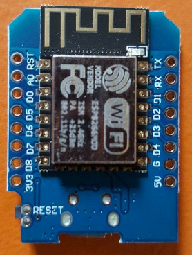

I bought [this D1 mini](https://www.ebay.co.uk/itm/363891216533)


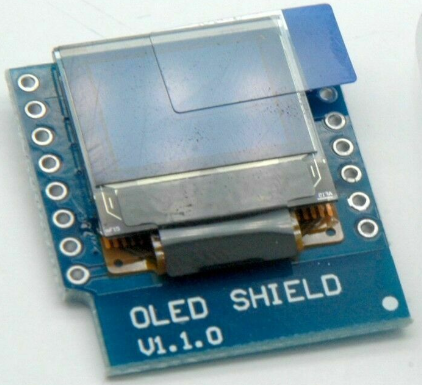

I bought [this OLED shield](https://www.ebay.co.uk/itm/313603433730?var=612417201805)


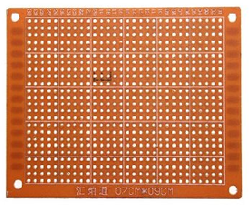

I bought [this prototyping board](https://www.ebay.co.uk/itm/265235487263)


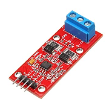

I bought [this MAX3845](https://www.ebay.co.uk/itm/403668533766)


For wire I suggest you strip a standard network cable and use wires from that.  You will probably have plenty of 1m cables spare which came with your broadband router, there are plenty of colours to choose from and it is a thin robust wire which will bend easily - and you can source them from the offcuts of the RS485 cable you'll be making - more on that later.

## Steps
### Cut the project board to a convenient size if you like.  I kept mine at 5cm x 7cm
### Wire the components according to the appropriate MAX3485 / MAX485 circuit diagram.

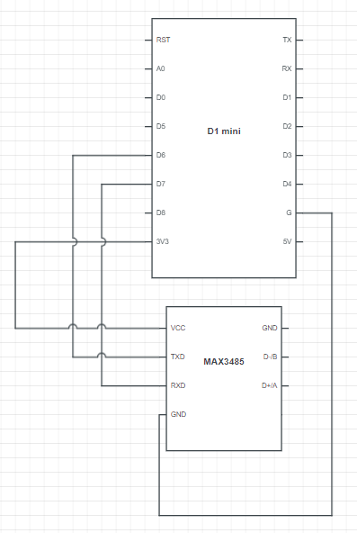


D5 is the serial control pin for devices with DR and RE flow control pins, or devices with an EN flow control pin.  If using devices with DR and RE pins, connect them both to D5.

D6 is the receiving pin on the D1 mini.  It connects to the transmitting TXD pin on the 3845 or RO on the 845.

D7 is the transmitting pin on the D1 mini.  It connects to the receiving RXD pin on the 3845 or DI on the 845.

If using the 845, you may want to invest in a 3.3V -> 5V bi directional logic shifter in-between D5, D6 and D7 so that output from those pins is lifted to 5V to be in tolerance of the 845 and likewise, 5V reduced back to 3.3V for input.  If you do use a logic shifter 5V would be used to power the 845, not 3.3V. 

Use long pinned headers on your ESP8266 (D1 mini) if you are stacking the optional OLED on top. Trim the legs so they fit comfortably into the sockets on the circuit board below.

I don't recommend soldering the anything permenantly to the prototyping board, besides headers and wiring.  This way, if you want to transfer the boards elsewhere it is just a case of unplugging them.


If you are using an ESP32, I am going to assume you are a little more advanced and just provide you with pin mappings below:

Display to ESP32
3.3v to 3.3v
GND to GND
SCL to SCL (GPIO22)
SDA to SDA (GPIO21)

MAX to ESP32
3.3v to 3.3v
GND to GND
RX to TX2 (GPIO17)
TX to RX2 (GPIO16)
EN to GPIO33 (for devices with an EN flow control pin)
DR+RE to GPIO33 (for devices with DR and RE flow control pins)


Here's how it looks when completed.  I ended up using an RJ45 socket and soldered the appropriate pair directly to the MAX3845 RX and TX pins so that I could simply plug/unplug the ethernet cable, without needing to unscrew/screw terminals on the MAX3845 every time.

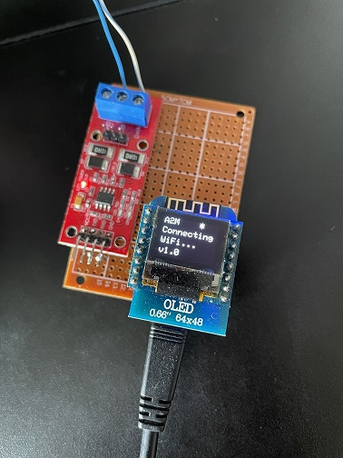
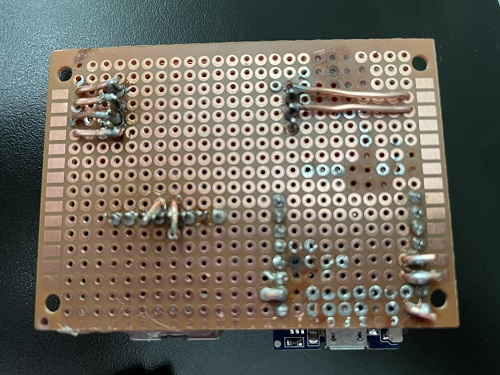

If you are not comfortable soldering, appreciating the rather insignificant cost of the parts involved, for a small fee I will happily build and post you a working unit, and it will be a lot nicer looking than my tesbed unit!

# Flashing
## Configuration
Download the six source files into a folder called Alpha2MQTT.  The source files needed are Alpha2MQTT.ino, Definitions.h, RegisterHandler.cpp, RegisterHandler.h, RS485Handler.cpp, RS485Handler.h.

Configure Alpha2MQTT by opening up Definitions.h and verifying/customising the following definitions for your need:
```
- Set your inverter (delete the //) between lines 25-28 and ensure the rest are commented out by adding //.
- Set your WiFi Access Point name on line 32.
- Set your WiFi password on line 33.
- Set your MQTT broker server on line 36.
- Set your MQTT broker port on line 37.  (Default is 1883)
- Set your MQTT username on line 38 if you use security (you should) or leave it blank.
- Set your MQTT password on line 39 if you use security (again, you should) or leave it blank.
- Set your Alpha2MQTT device name on line 43.  This is the device name presented on your network and is also how MQTT topics begin.  This document assumes Alpha2MQTT.
- Set your AlphaESS inverter's slave id on line 46.  By default this is 0x55 and shouldn't need changing unless you've changed it via Modbus or via inverters which have an integrated display.  Don't change it.
- Set your maximum payload size on line 54.  ESP8266's work well with 4096 bytes which is enough for 70 to 80 registers on any schedule or request.
- Set whether the device should auto restart every so many hours.  This is for specific routers only.  Uncomment line 70 if you want to use this feature
- Set the number of hours for an automatic restart on line 71
```

## Software Configuration
### Drivers
Download and install the [Wemos CH340 Driver](https://www.wemos.cc/en/latest/ch340_driver.html).
### Arduino IDE
Download and install the [Arduino IDE](https://www.arduino.cc/en/software).
### ESP8266 Libraries
Once installed and set up, you'll need the libraries for the ESP8266. Follow [this guide](https://randomnerdtutorials.com/how-to-install-esp8266-board-arduino-ide/) if you haven't completed that step before.
### Other Libraries
Add a few more libraries using the Tools / Manage Libraries menu:

1. PubSubClient

2. Adafruit GFX

3. Adafruit SSD1306 Wemos Mini OLED

(Even if you are not using the OLED screen, you should install the Adafruit libraries or it will not compile.)

...and upload.

After uploading, you should see activity on your device.  Ideally it will connect to WiFi (confirming those details are right) and connect to MQTT (confirming those details are right) and you should be left with a screen which shows BAD-CRC-UR.  Congratulations.  Unplug from your computer and source a power supply for the same USB cable.

## Connecting to your AlphaESS
You now need a suitable wire to connect to your AlphaESS system.  Luckily, all documented systems in the Modbus documentation indicate that it is a standard RJ45 (the same port you find on your broadband router) and my Smile B3 was no exception.

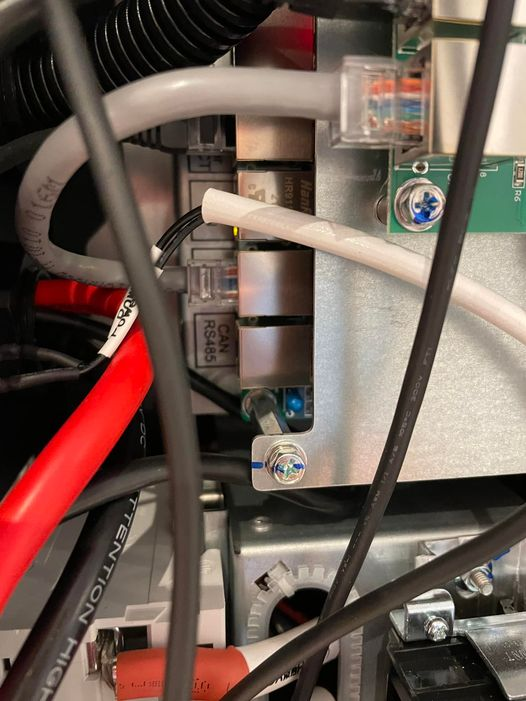

In the Modbus documentation it indicates that the CAN/RS485 port uses a twisted pair (will always be a pair for insulation) of A+/B- pins, and the Installation manual indicates pins 3 and 6 for RS485, with no indication of which is + and which is negative.  I took wires 3 and 6 as per standard RJ45 below (Green White / Green), plugged them in... and got nothing.  I reversed them around (not knowing which is + or -) and got... nothing.

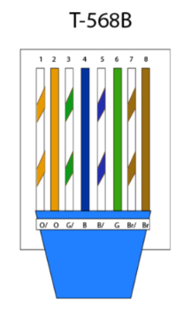

At first there were lots of questions.

Do Alpha enable Modbus out of the box?

Is my coding right?

Is my circuit wired up right?

After lots of checking and debugging, for my B3, I took a spare network cable from my router box, and cut off one end and trimmed back the sheath.  I split the pairs into Orange White + Orange / Green White + Green / Blue White + Blue / Brown White + Brown, and plugged the other end in the inverter.  I used a multi-meter against all of the pairs to see which one (if any) brought back a voltage.  I found a steady voltage (4.6V) across the Blue White + Blue pins, with Blue White being positive.  For clarity, Blue (Pin 4) was B-, Blue White (Pin 5) was A+.
I cannot guarantee this is the same for every model, but it *probably* is.

So what I ended up with was a hybrid cable looking like so:

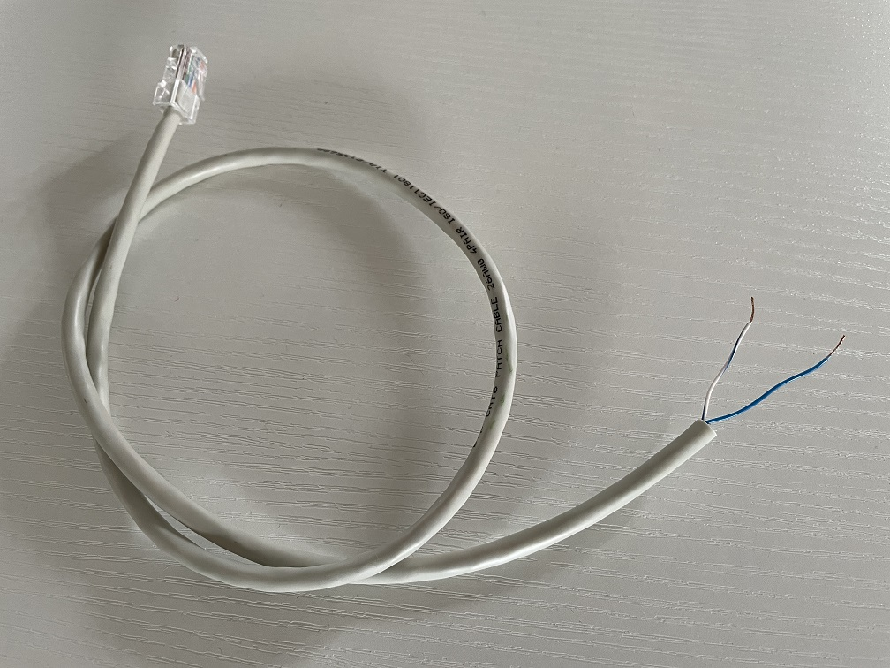

Connect the Alpha2MQTT unit to the 5v micro USB power supply you just found.  Connect the RJ45 to the CAN/RS485 port on your inverter and connect Blue White to A+ and Blue to B-.  (If your inverter used a different set of colours, please let me know so I can update the documentation.)


# Troubleshooting
## Screen blank
Make sure you solder all the pins on the OLED and ESP8266, not just those with wires attached.  

## No communication
Check A+/B- are correct using your hybrid cable.  The colours used will always be a pair for shielding, so you could always try individual pairs one at a time, and if it doesn't work one way, swap them around and see if it works the other.

Make sure the Slave IDs match.  Alpha systems use 0x55 by default but if you have changed it on an inverter with an on device interface, change the appropriate line in Definitions.h as documented above.

# OLED Screen
Here's what the various things on the OLED screen tell you:

## Line 1
Status bar.  It will display A2M in the top left corner, and in the top right will show a flashing asterisk (*) to indicate normal operations, will show a steady W when WiFi is connected and a steady M when MQTT is connected.

## Lines 2, 3 and 4
Current status, depending on what that status is.

### Connecting to WiFi
```
Connecting
WiFi...
Version Number
```

### Connecting to MQTT
```
Connecting
MQTT...
Version Number
```

### Comms established with inverter
```
Hello
Serial Number
Serial Number Continued
```

### Normal Operation
```
Normal
Battery Power (W) (-charging, +discharging)
Battery SOC (%)
```

### Forced Charging Operation
```
Charging
Battery Power (W) (-charging, +discharging)
Battery SOC (%)
 ```

### Forced Discharging Operation
```
Charging
Battery Power (W) (-charging, +discharging)
Battery SOC (%)
```

### CRC Errors
If a message is read from the inverter that fails the CRC checksum, line 4 will display one of "BAD-CRC-UR" or "BAD-CRC-HB".  This could be caused by a loose or bad RS485 wire or by unsupported features. A few of these is normal, a lot could indicate a problem.

During WiFi Connection and MQTT Connection phases, line 4 shows the Alpha2MQTT software version.  Check that you have the latest version at https://github.com/dxoverdy/Alpha2MQTT

### Alpha2MQTTs Around The World
If you have your own Alpha2MQTT, be sure to send me a picture of it in action so I can add it to this page!


AC from UK - Even got a box sorted for it!

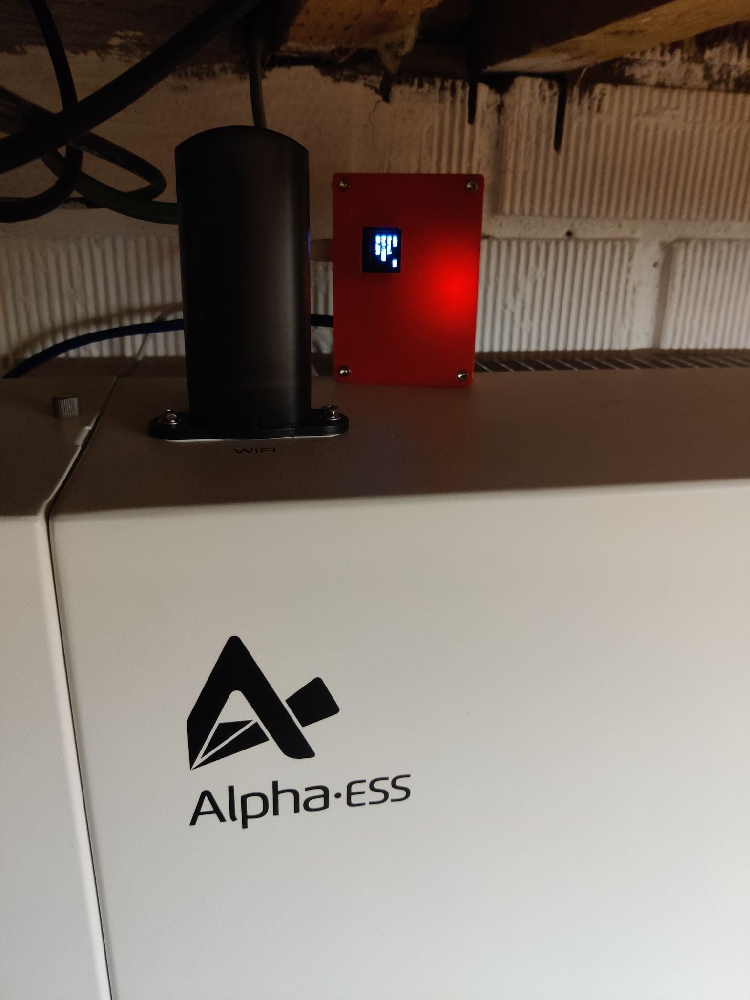


GS from UK - Wall mounted using grips!

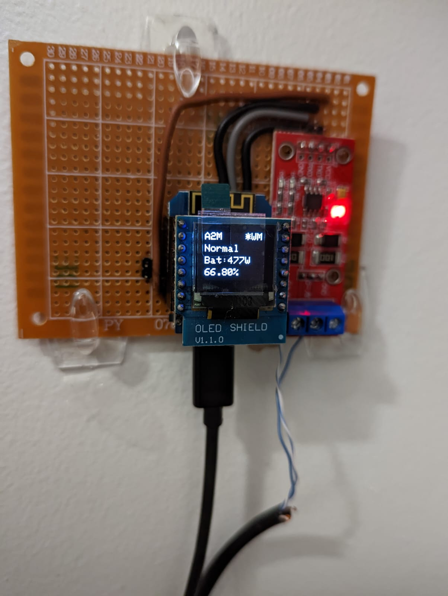


DS from UK - Used his Alpha2MQTT together with a self-build ePaper device to report stats in his house in real time!


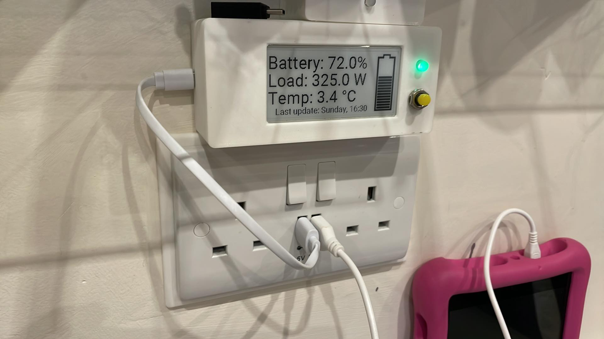


MK from AU - Very much a minimalist build, but demonstrates that just two cheap components can get a unit up and running!

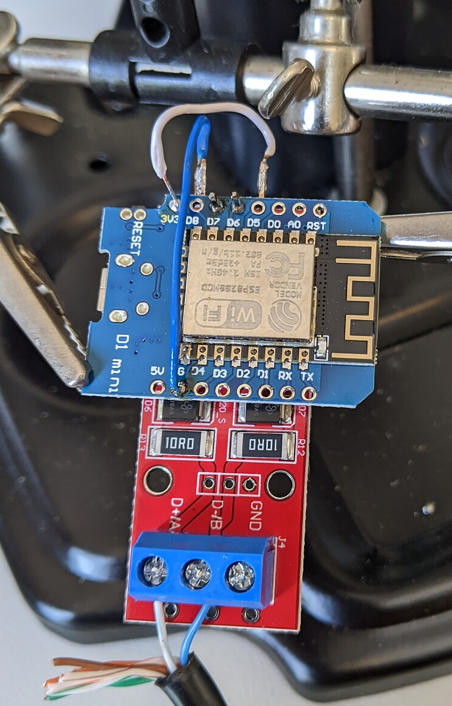


DC from UK - Built using an ESP32!  Thanks for your input regardings stubborn Smile 5 debugging!

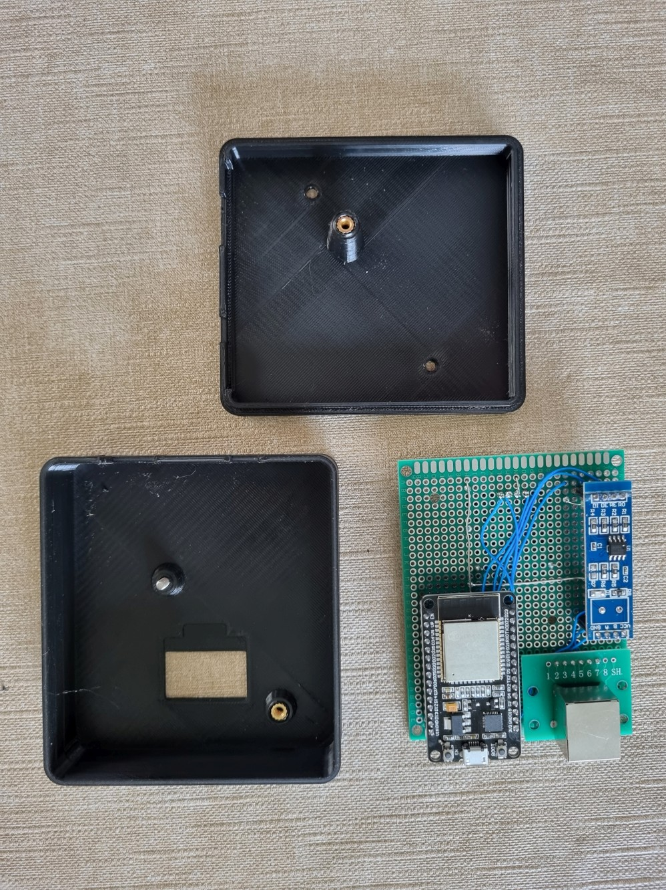

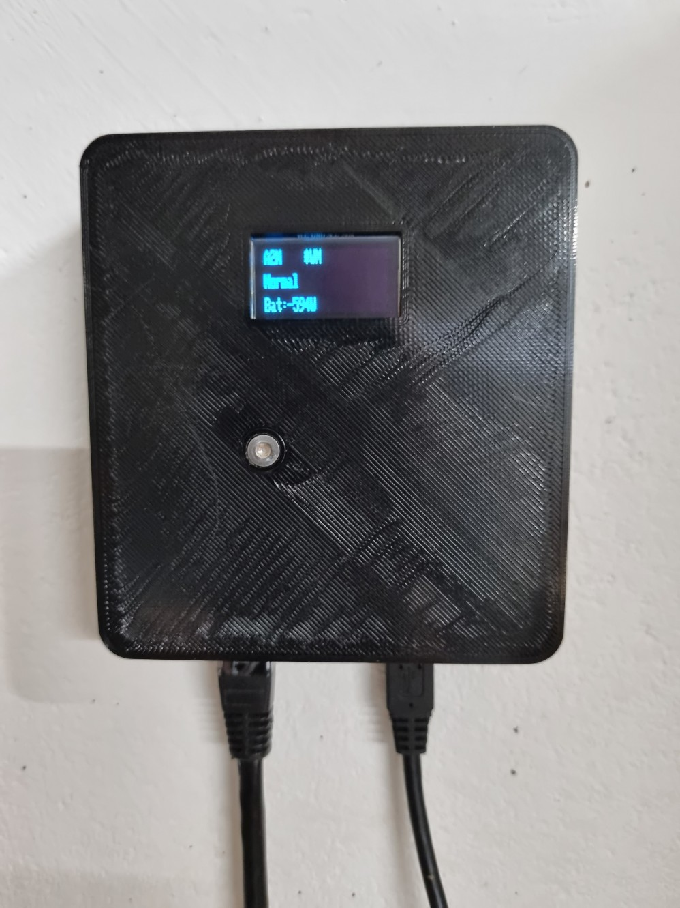


DM from UK!

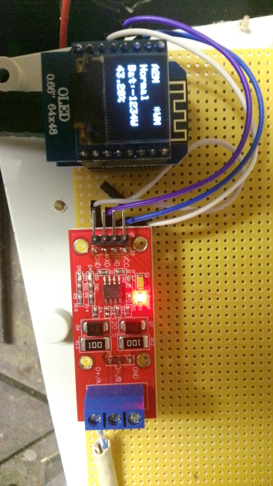


PN from CR!

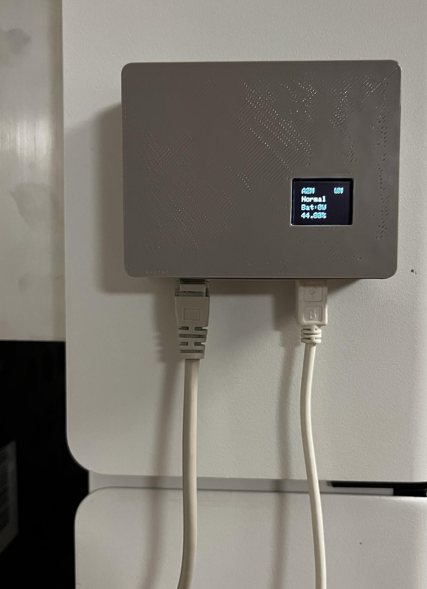
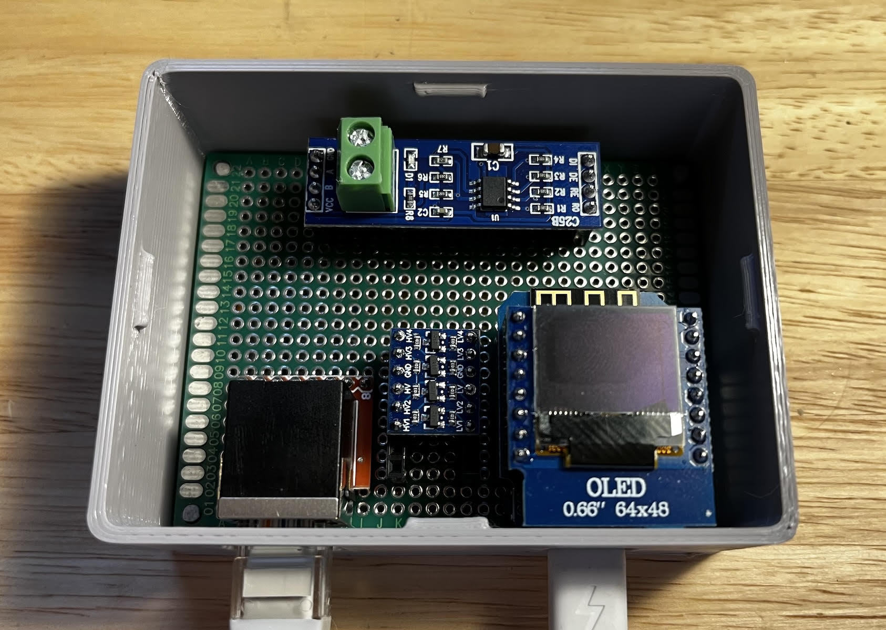
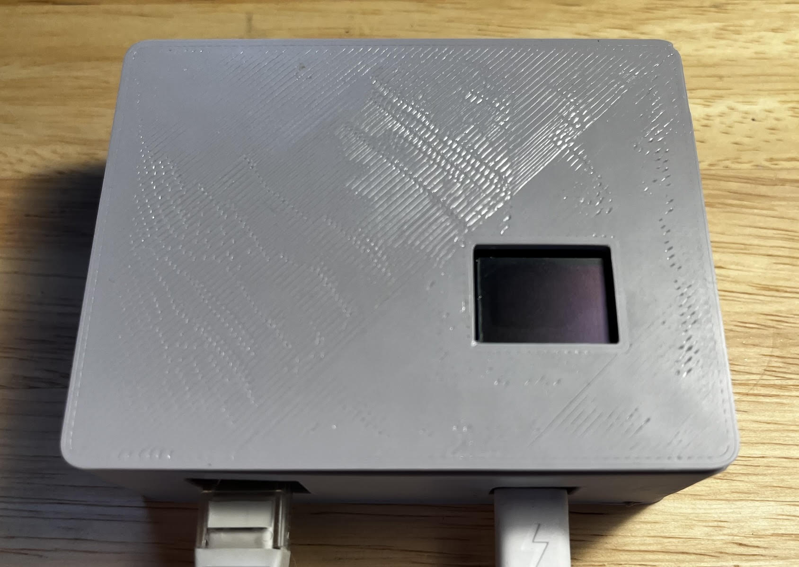
